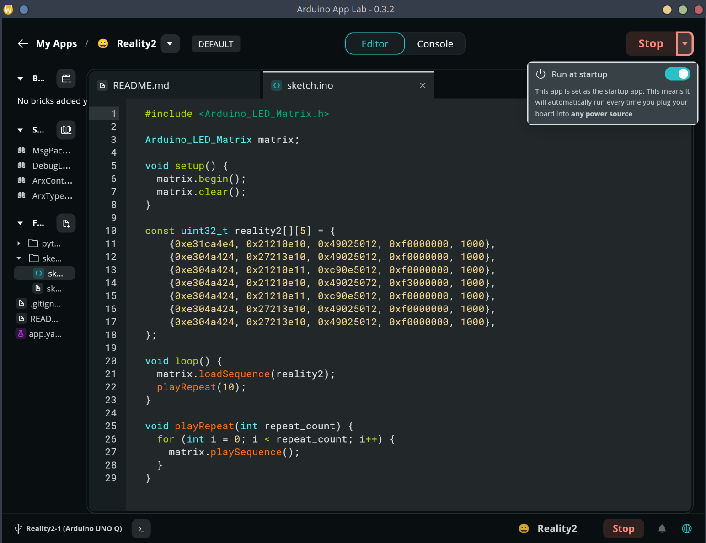

# Arduino UNO-Q

The Arduino UNO-Q is a small, low-cost, and easy-to-use development board based on the ATmega328P microcontroller. It is designed to be a drop-in replacement for the Arduino UNO and is compatible with all Arduino shields and libraries.

Running Reality2 on the Arduino UNO-Q is pretty straight forward, just download the latest version of the Reality2 software stack from GitHub for 64 bit ARM architecture and follow the instructions in the README file.

The reason this works is because the UNO-Q runs a version of Debian Linux that is compatible with the Reality2 Node software.

## Display R2 on the LED Matrix
To get the LED Matrix display to show a neat little R2 animation, use the sketch below.  Create a new project using the Arduino App Lab and paste in the sketch.
To get this to open when the Arduino UNO-Q boots up, make sure it is set to 'Run at Startup' as shown in the image below.





```c
#include <Arduino_LED_Matrix.h>

Arduino_LED_Matrix matrix;

void setup() {
  matrix.begin();
  matrix.clear();
}

const uint32_t reality2[][5] = {
    {0xe31ca4e4, 0x21210e10, 0x49025012, 0xf0000000, 1000},
    {0xe304a424, 0x27213e10, 0x49025012, 0xf0000000, 1000},
    {0xe304a424, 0x21210e11, 0xc90e5012, 0xf0000000, 1000},
    {0xe304a424, 0x21210e10, 0x49025072, 0xf3000000, 1000},
    {0xe304a424, 0x21210e11, 0xc90e5012, 0xf0000000, 1000},
    {0xe304a424, 0x27213e10, 0x49025012, 0xf0000000, 1000},
    {0xe304a424, 0x27213e10, 0x49025012, 0xf0000000, 1000},
};

void loop() {
  matrix.loadSequence(reality2);
  playRepeat(10);
}

void playRepeat(int repeat_count) {
  for (int i = 0; i < repeat_count; i++) {
    matrix.playSequence();
  }
}
```

## Autostarting Reality2 Node on startup
This is a generic solution for any Debian based Linux.


1. Create the service file
```bash
sudo nano /etc/systemd/system/reality2-node.service
```
with the contents:

```bash
[Unit]
Description=Reality2 Node
After=network-online.target
Wants=network-online.target

[Service]
Type=simple
User=arduino
WorkingDirectory=/home/arduino/reality2/aarch64_GNU_Linux_dev/reality2
ExecStart=/home/arduino/reality2/aarch64_GNU_Linux_dev/reality2/run
Restart=on-failure
RestartSec=3
# Optional but often helpful:
# Environment=HOME=/home/arduino
# Environment=LANG=C.UTF-8
# Environment=LC_ALL=C.UTF-8

[Install]
WantedBy=multi-user.target
```

setting the `WorkingDirectory` and `ExecStart` to the location of the Reality2 Node executable.


2. Enable the service
```bash
sudo systemctl enable reality2-node.service
```
3. Start the service
```bash
sudo systemctl start reality2-node.service
```
4. Check the status of the service
```bash
sudo systemctl status reality2-node.service
```

## To stop the service from starting on boot
```bash
sudo systemctl disable reality2-node.service
```
And to stop the service from running:
```bash
sudo systemctl stop reality2-node.service
```


## To kill the already running Reality2 node process
```bash
sudo pkill -f reality2/run
```
